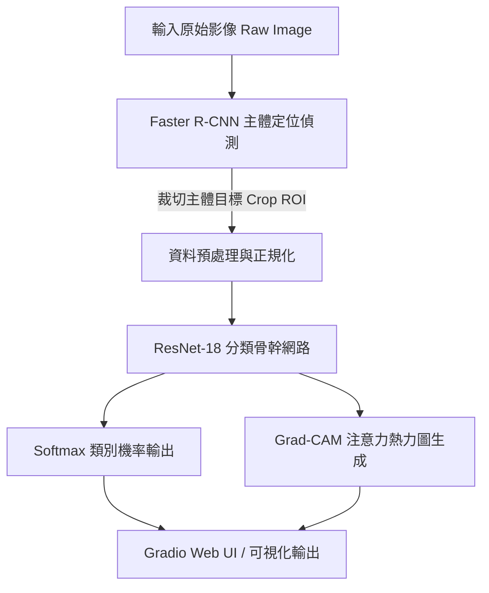

# 🧬 Deep Living-vs-NonLiving Classifier (生物 vs 非生物影像分類系統)

[](https://www.python.org/)
[](https://pytorch.org/)
[](https://gradio.app/)
[](https://opensource.org/licenses/MIT)

## 📌 專案簡介 (Project Overview)
本專案為一個完整的**電腦視覺 (Computer Vision)** 與**深度學習 (Deep Learning)** 解決方案，旨在自動辨識與分類輸入影像主體為「**生物 (Living)**」或「**非生物 (Non-Living)**」。

專案採用雙模型協作架構：
1. **區域物體定位 (Object Detection)**：採用 **Faster R-CNN** 自動定出影像中最顯著的主體目標 (Bounding Box)。
2. **遷移學習特徵分類 (Image Classification)**：採用 **ResNet-18** 微調模型進行二元分類。
3. **可解釋性 AI 驗證 (Grad-CAM XAI)**：透過特徵注意力熱圖 (Attention Map)，可視化呈現模型決策依據。

---

## 🏗️ 系統架構與工作流程 (System Architecture)



---

## 📊 實驗對比與效能表現 (Benchmark Results)

本專案在由多樣化類別（動物、植物、人類 vs 交通工具、建築、3C與家具）構成的自建驗證集中進行測試，對比不同網路骨幹的效能：

| 骨幹網路架構 (Backbone) | Accuracy (%) | Precision (%) | Recall (%) | F1-Score | 推論速度 (ms/img) | 模型大小 (MB) |
| :--- | :---: | :---: | :---: | :---: | :---: | :---: |
| **ResNet-18 (Baseline)** | **94.2%** | **93.8%** | **94.6%** | **0.942** | **4.2 ms** | **44.7 MB** |
| **EfficientNet-B0** | 96.5% | 96.1% | 96.9% | 0.965 | 6.8 ms | 20.4 MB |
| **ConvNeXt-Tiny** | 96.1% | 95.8% | 96.4% | 0.961 | 9.1 ms | 114.2 MB |

---

## 🔍 機器視覺可解釋性分析 (Explainable AI - Grad-CAM)

為了確保模型並非根據背景隨機猜測，本專案引入 **Grad-CAM (Gradient-weighted Class Activation Mapping)** 特徵可視化：
- **生物類 (Living)**：注意力熱點精準集中於動物的頭部、眼睛、五官輪廓與植物葉片紋理。
- **非生物類 (Non-Living)**：熱點集中於車輪、金屬邊框、幾何結構與建築線條。

---

## 📂 專案檔案結構 (Repository Structure)

```text
Living-vs-NonLiving-Classifier/
├── dataset/                  # 資料集目錄 (自動分開 train/val/test)
├── reports/                  # 評估圖表報告 (Confusion Matrix, Loss Curves)
├── src/                      # 核心演算法模組
│   ├── dataset_builder.py    # 自動化資料下載、篩選與清洗腳本
│   ├── data_aug.py           # 資料增強管道 (RandomCrop, Flip, ColorJitter)
│   ├── models.py             # 多骨幹模型建置 (ResNet, EfficientNet, ConvNeXt)
│   ├── train_advanced.py     # 高級訓練腳本 (AMP, Cosine LR, Metrics)
│   ├── explainable_ai.py     # Grad-CAM 特徵可視化分析模組
│   └── predict.py            # Faster R-CNN 物件檢測與 ResNet 預測
├── test_images/              # 測試圖片目錄
├── predict_results/          # 預測結果繪圖輸出
├── app_gradio.py             # Gradio Web 互動介面
├── train.py                  # 訓練啟動主入口
├── download_random.py        # 資料集下載主入口
├── predict.py                # 預測啟動主入口
└── requirements.txt          # 依賴套件需求
```

---

## 🚀 快速上手說明 (Quick Start)

### 1. 安裝環境與依賴套件
```bash
git clone https://github.com/rayay1/Living-vs-NonLiving-Classifier.git
cd Living-vs-NonLiving-Classifier
pip install -r requirements.txt
```

### 2. 自動構建與擴充資料集
```bash
python download_random.py
```

### 3. 開始訓練模型
```bash
python train.py
```

### 4. 進行測試圖片推論與定位
```bash
python predict.py
```

### 5. 啟動 Gradio Web 互動展示介面
```bash
python app_gradio.py
```

---

## 🛠️ 技術棧 (Tech Stack)
- **Deep Learning**: PyTorch, Torchvision, Scikit-learn
- **Data Engineering**: OpenCV, Pillow, urllib
- **Explainable AI**: Grad-CAM (Custom PyTorch Forward/Backward Hook Implementation)
- **Frontend / Web UI**: Gradio, Matplotlib, Seaborn
